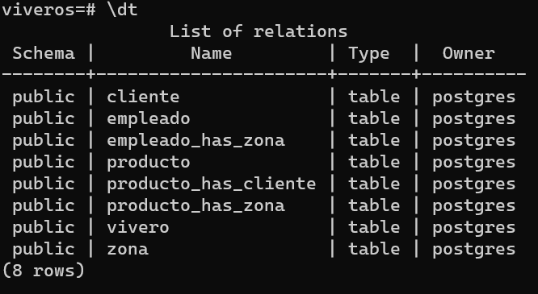
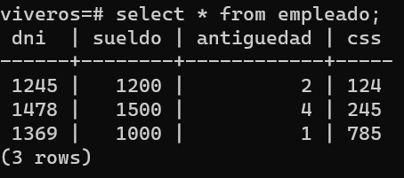
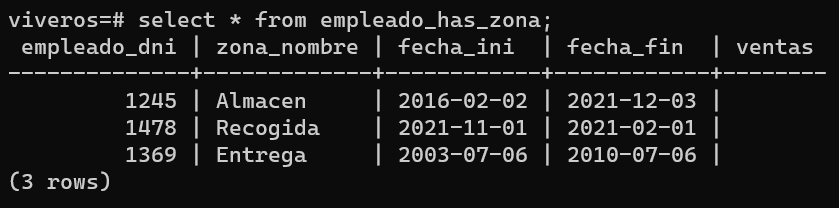
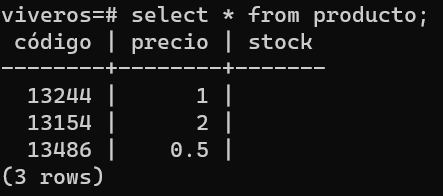
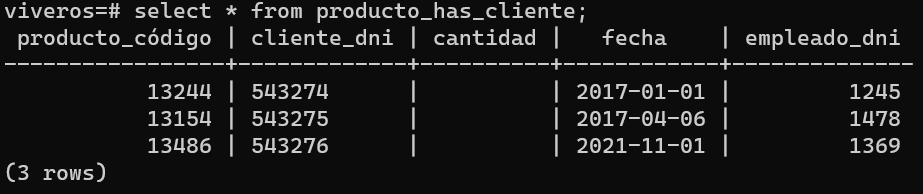
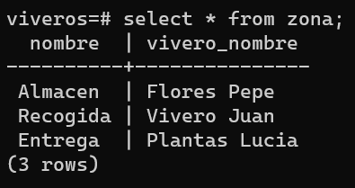
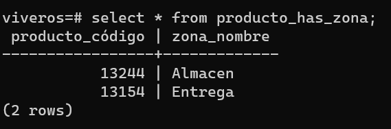

# Práctica 3 Modelo Lógico Relacional:

### Imagen del diseño realizado con MySQL.  

  

### Modelo realizado con Mysql Workbench.  
[Link.](./res/MYMODEL.mwb)    

### Script para postgre.  
[Link.](./res/script2.sql)    

### Fotografías de comandos  

#### - \dt;  
  

#### - select * from cliente;  
  

#### - select * from empleado;  
  

#### - select * from empleado_has_zona;  
  

#### - select * from producto;  
  

#### - select * from producto_has_cliente;  
  

#### - select * from zona;  
  

#### - select * from producto_has_zona;  
  
