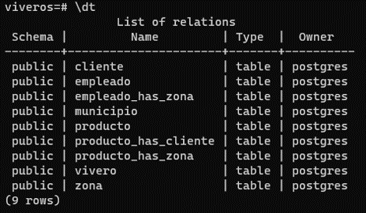
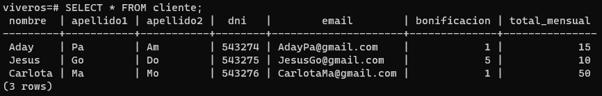
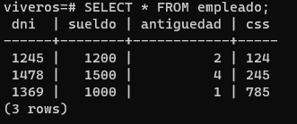
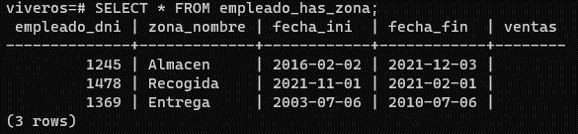
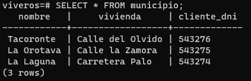
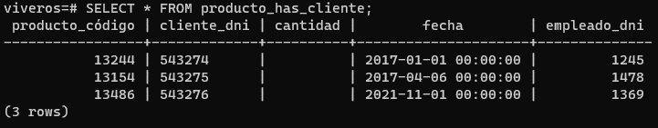
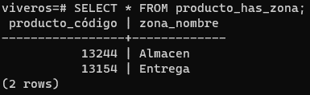
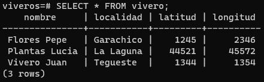
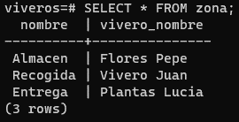

# Práctica 4. Modelo Lógico Relacional (Disparadores):

### Script para postgres.  
[Link.](./script_vivero.sql)    

### Fotografías de comandos  

#### - \dt;  
  

#### - select * from cliente;  
  

#### - select * from empleado;  
  

#### - select * from empleado_has_zona;  

#### - select * from municipio;
  

#### - select * from producto;  
  

#### - select * from producto_has_cliente;  
  

#### - select * from producto_has_zona;  

#### - select * from vivero;

#### - select * from zona;  
  

