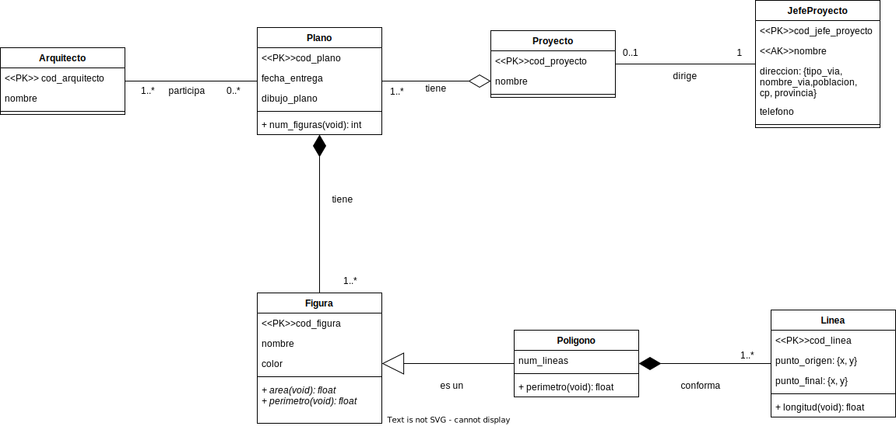

# Modelo Objeto-Relacional Arquitectos  

*El script adjunto requiere versiones de postgres superiores o iguales a la 12.*   
---  
  
---
## Características de Objeto-Relacional utilizadas: 
- Herencia (polígono hereda de figura).  
- Tipos compuestos (dirección, punto).  
- Enumeración (tipos de vía).  


A continuación se muestra la implementación junto con múltiples pruebas realizadas a la base de datos "Arquitectos".  

## Pruebas de la ejecución.

### Jefe de proyecto con nombre duplicado.  
Insertar un jefe de proyecto con un nombre duplicado genera una exepción dado que no está permitido que dos entradas de esta tabla tengan el mismo nombre.    
```sql
-> SELECT * FROM jefe_proyecto;
 cod_jefe_proyecto |  nombre  |  telefono   |                      direccion
-------------------+----------+-------------+------------------------------------------------------
                 2 | Fernando | 34640000000 | (avenida," Trinididad"," La Laguna"," 38302"," S/C")
(1 row)

-> INSERT INTO jefe_proyecto (cod_jefe_proyecto, nombre, telefono, direccion)
VALUES (DEFAULT, 'Fernando', '34640000001', '(avenida, " Trinididad", " La Laguna", " 38302", " S/C")');
ERROR:  duplicate key value violates unique constraint "jefe_proyecto_nombre_uindex"
DETAIL:  Key (nombre)=(Fernando) already exists.
```
### Dos proyectos no pueden tener el mismo jefe de proyecto.  
```sql
-> SELECT * FROM proyecto;
 cod_proyecto |  nombre   | cod_jefe_proyecto
--------------+-----------+-------------------
            1 | Escorpión |                 2
(1 row)

-> INSERT INTO proyecto (cod_proyecto, nombre, cod_jefe_proyecto)
VALUES (DEFAULT, 'No Escorpión', 2);
ERROR:  duplicate key value violates unique constraint "proyecto_cod_jefe_proyecto_uindex"
DETAIL:  Key (cod_jefe_proyecto)=(2) already exists.
```
### Todo proyecto debe tener un jefe de proyecto.  
```sql
-> INSERT INTO public.proyecto (cod_proyecto, nombre, cod_jefe_proyecto)
VALUES (DEFAULT, 'No Escorpión', null);
ERROR:  null value in column "cod_jefe_proyecto" of relation "proyecto" violates not-null constraint
DETAIL:  Failing row contains (6, No Escorpión, null).
```
### Un plano puede tener múltiples arquitectos.


```sql
-> SELECT plano.*, arquitecto.nombre AS arquitecto FROM arquitecto_trabaja_plano NATURAL JOIN arquitecto NATURAL JOIN plano;
 cod_plano | fecha_entrega | num_figuras | dibujo_plano | cod_proyecto | arquitecto
-----------+---------------+-------------+--------------+--------------+------------
         2 | 2022-01-26    |           0 |              |            1 | Paco
         2 | 2022-01-26    |           0 |              |            1 | Pepe                
(2 row)
```
### Añadir una figura a un plano incrementa su número de figuras.
En esta secuencia, se muestra como se va incrementando el número de figuras en la entrada de plano.  
```sql
-> SELECT * FROM plano;
 cod_plano | fecha_entrega | num_figuras | dibujo_plano | cod_proyecto
-----------+---------------+-------------+--------------+--------------
         2 | 2022-01-26    |           0 |              |            1
(1 row)

-> INSERT INTO poligono (cod_figura, nombre, color, area, perimetro, cod_plano, num_lineas)
VALUES (DEFAULT, 'Triangulo', '000000', DEFAULT, DEFAULT, 2, DEFAULT);

INSERT 0 1
-> SELECT * FROM plano;
 cod_plano | fecha_entrega | num_figuras | dibujo_plano | cod_proyecto
-----------+---------------+-------------+--------------+--------------
         2 | 2022-01-26    |           1 |              |            1
(1 row)
-> INSERT INTO poligono (cod_figura, nombre, color, area, perimetro, cod_plano, num_lineas)
VALUES (DEFAULT, 'Linea recta', '000000', DEFAULT, DEFAULT, 2, DEFAULT);
INSERT 0 1
-> SELECT * FROM plano;
 cod_plano | fecha_entrega | num_figuras | dibujo_plano | cod_proyecto
-----------+---------------+-------------+--------------+--------------
         2 | 2022-01-26    |           2 |              |            1
(1 row)
```
### Eliminar una figura reduce el número de figuras.
También se actualiza la entrada en plano si borramos una figura.  
```sql
-> SELECT * FROM plano;
 cod_plano | fecha_entrega | num_figuras | dibujo_plano | cod_proyecto
-----------+---------------+-------------+--------------+--------------
         2 | 2022-01-26    |           2 |              |            1
(1 row)
-> DELETE FROM poligono WHERE cod_figura = 4;
DELETE 1
-> SELECT * FROM plano;
 cod_plano | fecha_entrega | num_figuras | dibujo_plano | cod_proyecto
-----------+---------------+-------------+--------------+--------------
         2 | 2022-01-26    |           1 |              |            1
(1 row)
```  
### Intentar crear figura sin plano.
```sql
INSERT INTO figura (nombre, color, cod_plano)
VALUES ('Cuadrado', 'ffffff', null);
ERROR:  null value in column "cod_plano" of relation "figura" violates not-null constraint
DETAIL:  Failing row contains (6, Cuadrado, ffffff, 0, 0, null).
```  
### Agregar lineas.
```sql
INSERT INTO linea (punto_origen, punto_final, cod_poligono)
VALUES ('(0, 0)', '(1, 1)', 3);
INSERT 0 1
-> INSERT INTO linea (punto_origen, punto_final, cod_poligono)
VALUES ('(1, 1)', '(1, 0)', 3);
INSERT 0 1
-> INSERT INTO linea (punto_origen, punto_final, cod_poligono)
VALUES ('(1, 0)', '(0, 0)', 3);
INSERT 0 1
-> SELECT * FROM linea;
 cod_linea | punto_origen | punto_final | cod_poligono | longitud
-----------+--------------+-------------+--------------+----------
        14 | (0,0)        | (1,1)       |            3 |        1
        15 | (1,1)        | (1,0)       |            3 |        1
        16 | (1,0)        | (0,0)       |            3 |        1
        17 | (1,0)        | (0,3)       |            3 |        3
(4 rows)
-> SELECT * FROM poligono;
 cod_figura |  nombre   | color  | area | perimetro | cod_plano | num_lineas
------------+-----------+--------+------+-----------+-----------+------------
          3 | Triangulo | 000000 |    0 |         6 |         2 |          4
(1 row)
```
### Eliminar lineas.
```sql
-> SELECT * FROM poligono;
 cod_figura |  nombre   | color  | area | perimetro | cod_plano | num_lineas
------------+-----------+--------+------+-----------+-----------+------------
          3 | Triangulo | 000000 |    0 |         6 |         2 |          4
(1 row)
-> DELETE FROM linea WHERE cod_linea = 17;
DELETE 1
-> SELECT * FROM poligono;
 cod_figura |  nombre   | color  | area | perimetro | cod_plano | num_lineas
------------+-----------+--------+------+-----------+-----------+------------
          3 | Triangulo | 000000 |    0 |         3 |         2 |          3
(1 row)
```
### Intentar crear figura sin plano.
```sql
INSERT INTO linea (punto_origen, punto_final, cod_poligono)
VALUES ('(1, 0)', '(0, 3)', NULL);
ERROR:  null value in column "cod_poligono" of relation "linea" violates not-null constraint
DETAIL:  Failing row contains (18, (1,0), (0,3), null, 3).
```
### Si se elimina el proyecto, el plano persiste.
```sql
-> SELECT * FROM plano;
 cod_plano | fecha_entrega | num_figuras | dibujo_plano | cod_proyecto
-----------+---------------+-------------+--------------+--------------
         2 | 2022-01-26    |           1 |              |            1
(1 row)

-> DELETE FROM proyecto WHERE cod_proyecto = 1;
DELETE 1
-> SELECT * FROM plano;
 cod_plano | fecha_entrega | num_figuras | dibujo_plano | cod_proyecto
-----------+---------------+-------------+--------------+--------------
         2 | 2022-01-26    |           1 |              |
(1 row)
```
### Eliminar proyecto elimina todas sus figuras, y si estas son polionos también se eliminan las lineas de los mismos.
```sql
-> SELECT * FROM plano;
 cod_plano | fecha_entrega | num_figuras | dibujo_plano | cod_proyecto
-----------+---------------+-------------+--------------+--------------
         2 | 2022-01-26    |           1 |              |
(1 row)

-> SELECT * FROM figura;
 cod_figura |  nombre   | color  | area | perimetro | cod_plano
------------+-----------+--------+------+-----------+-----------
          3 | Triangulo | 000000 |    0 |         3 |         2
(1 row)

-> SELECT * FROM linea;
 cod_linea | punto_origen | punto_final | cod_poligono | longitud
-----------+--------------+-------------+--------------+----------
        14 | (0,0)        | (1,1)       |            3 |        1
        15 | (1,1)        | (1,0)       |            3 |        1
        16 | (1,0)        | (0,0)       |            3 |        1
(3 rows)
-> SELECT * FROM plano;
 cod_plano | fecha_entrega | num_figuras | dibujo_plano | cod_proyecto
-----------+---------------+-------------+--------------+--------------
         2 | 2022-01-26    |           1 |              |
(1 row)

-> SELECT * FROM figura;
 cod_figura |  nombre   | color  | area | perimetro | cod_plano
------------+-----------+--------+------+-----------+-----------
          3 | Triangulo | 000000 |    0 |         3 |         2
(1 row)

-> SELECT * FROM linea;
 cod_linea | punto_origen | punto_final | cod_poligono | longitud
-----------+--------------+-------------+--------------+----------
        14 | (0,0)        | (1,1)       |            3 |        1
        15 | (1,1)        | (1,0)       |            3 |        1
        16 | (1,0)        | (0,0)       |            3 |        1
(3 rows)
```